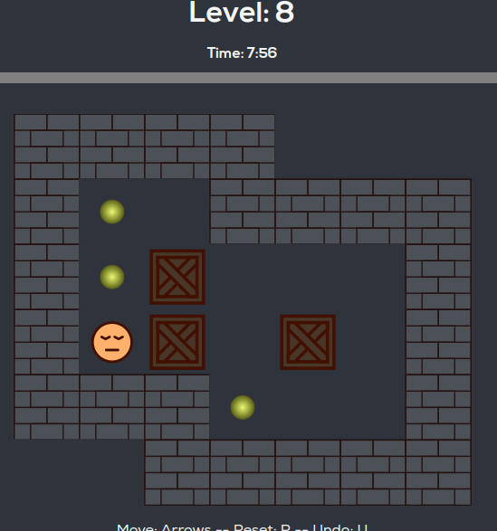

# Sokoban (box world!)

Example of solving Sokoban game using BFS, or A* with linear assignment (Hungarian algorithm) heuristic.

## Usage

`python src/main.py <lv>`

### External links:

- online: https://dosgamezone.com/game/box-world-20225.html
- youtube: https://www.youtube.com/playlist?list=PL0DNUAK_UWIcCxsXT1NCY3wDfxPwUcYE7
